# 🐾 PetFit

  <!-- Line 1 -->
  
  
  
  
  

  <!-- Line 2 -->
  
  
  
  
  
  

## 서비스 소개

반려동물의 건강 루틴, 특이사항, 알람을 한 곳에서 관리할 수 있는 `반려동물 건강 관리 서비스`입니다.
사용자는 하루 일정과 건강 기록을 직관적으로 확인하고, 반복 루틴과 특이사항을 편리하게 관리할 수 있습니다.

**MVP 1.0**

- 온보딩, 루틴, 특이사항, 알람 등 핵심 사용자 플로우 설계 및 구현

**MVP 2.0**

- **SSOT(단일 진실원)** 기반 데이터 구조로 리팩토링

- 도메인 기반 **Custom Hook 패턴** 도입으로 로직 책임 분리

- **디자인 시스템(DS)** Seed 컴포넌트 구축 및 점진적 치환 전략 적용

> MVP 2.0은 `데이터 흐름 안정화(SSOT)`, `책임 분리(Custom Hook)`, `UI 표준화(Design System)`를 중심으로 전체 구조를 재정비한 버전입니다. 
> 이를 통해 **중복 상태를 제거**하고, 비즈니스 로직과 UI의 **경계를 명확히** 하며, **일관된 사용자 경험**을 제공할 수 있는 기반을 마련했습니다.

  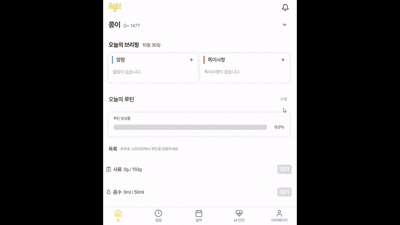

## 📌 주요 기능

|            온보딩 - 정보 등록 페이지            |            온보딩 - 루틴 설정 페이지            |                홈 페이지                 |                미완 루틴 모달                 |
| :---------------------------------------------: | :---------------------------------------------: | :--------------------------------------: | :-------------------------------------------: |
| 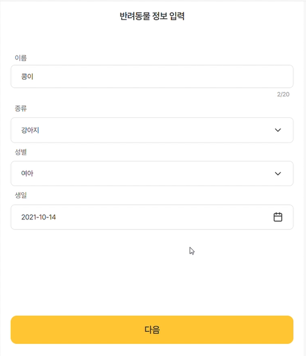 | 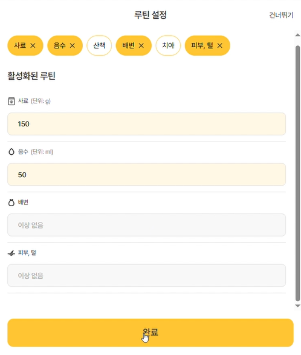 | 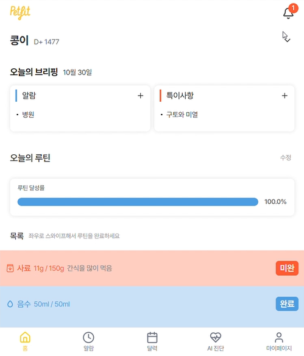 | 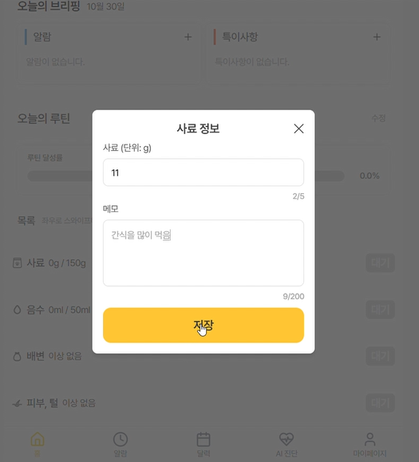 |

|                알람 페이지                 |                달력 페이지                 |             AI 진단 상세 페이지             |                마이 페이지                 |
| :----------------------------------------: | :----------------------------------------: | :-----------------------------------------: | :----------------------------------------: |
| 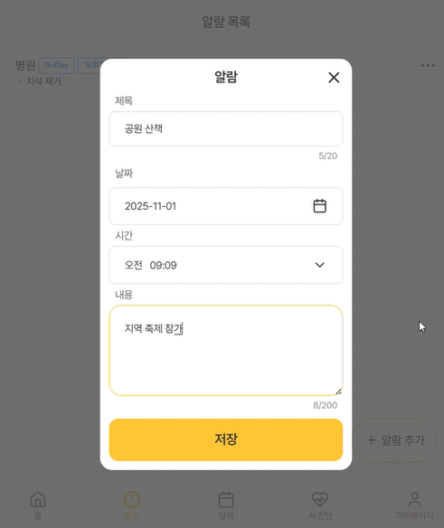 | 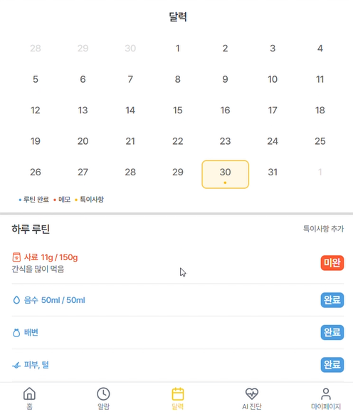 | 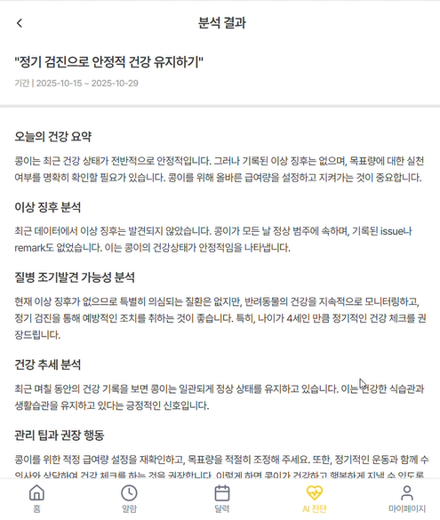 | 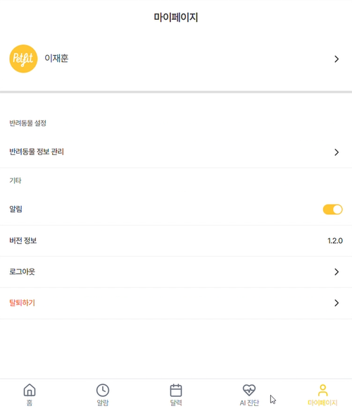 |

## 프론트엔드 구조

- **전역상태 관리 구조 (RTK + React Query)**

  아래 그림은 클라이언트 세션(RTK)과 서버 데이터(React Query)가 어떻게 분리/연동되는지 보여주는 구조도입니다.

  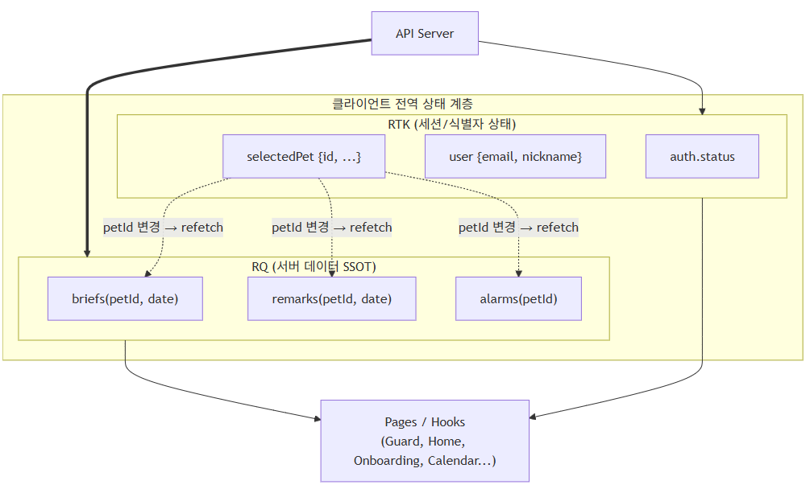

  > Redux Toolkit은 인증 정보와 선택된 반려동물 같은 **클라이언트 세션 상태**를 관리합니다. 
  > React Query는 이를 기반으로 루틴/특이사항/알람 데이터를 **서버 데이터 단일 진실원(SSOT)으로** 유지하며, petId 변경 시 자동 refetch를 통해 데이터 일관성을 보장합니다. 
  > 모든 페이지와 도메인 훅은 **Redux → React Query 순으로 의존**해, 서버 데이터가 최종 진실원이 되는 구조를 유지합니다.

- **User Flow**

  아래 그림은 사용자가 앱에 처음 진입해 주요 기능으로 이동하기까지의 전체 여정을 시각화한 흐름도입니다.

  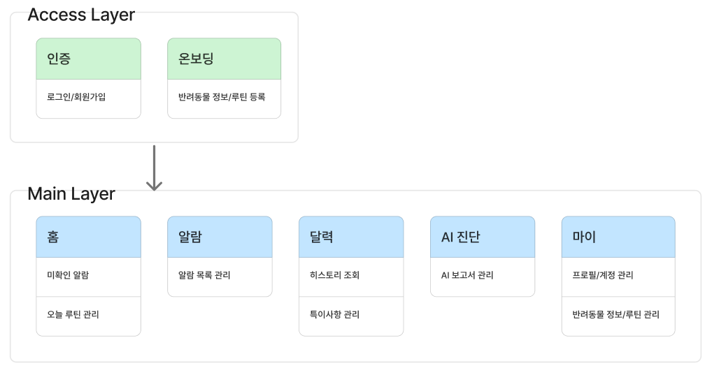

  > Access Layer(로그인/온보딩)를 거쳐 Main Layer(홈/알람/달력/AI/마이)로 이동하는 실제 사용자 흐름을 표현했습니다. 
  > 기능 목록이 아니라 **사용자 경험 기반 플로우**를 기준으로 구성해, **서비스의 전체 흐름**과 **각 화면에서 발생하는 주요 액션**을 직관적으로 이해할 수 있습니다.

- **세션/인증 상태머신**

  아래 그림은 OAuth 콜백 이후 앱 내부의 인증 상태 전이를 모델링한 FSM입니다.

  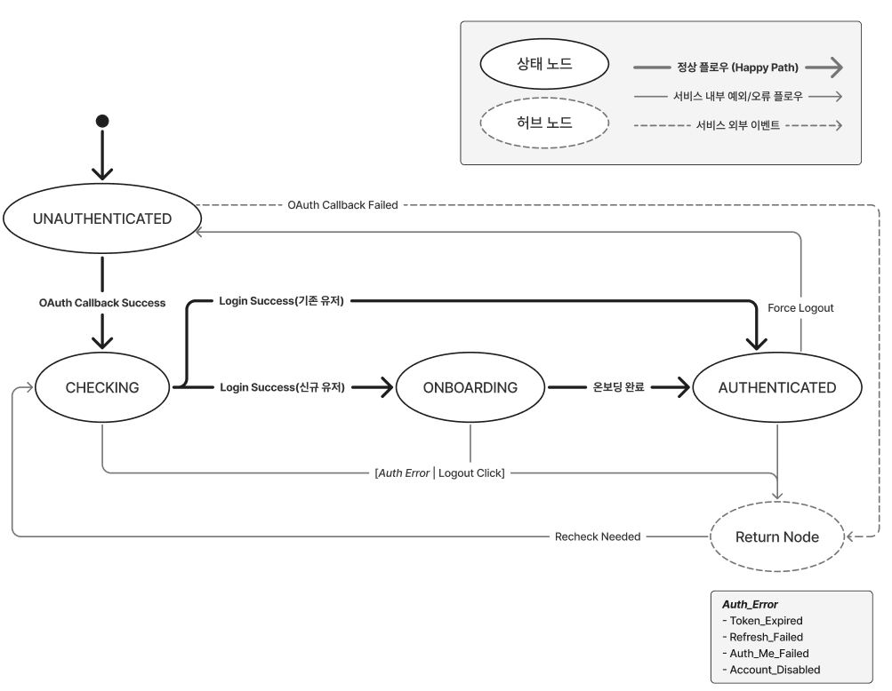

  > Kakao OAuth 인증 이후, Access/Refresh Token 기반의 **세션 유지/재발급/강제 로그아웃 흐름**을 상태 전이로 표현했습니다. 
  > `Unauthenticated → Checking → Onboarding → Authenticated`로 이어지는 정상 플로우와, `Token 만료/재발급 실패` 등 오류 발생 시 Return Node(허브 노드) 로 회귀하는 구조를 통해 **예측 가능한 인증 흐름**을 보장합니다.

## 내가 구현한 기능

> 기능별 GIF와, 관련 핵심 흐름에 대한 시퀀스 다이어그램으로 함께 정리했습니다.

### 1. 로그인, 반려동물 정보 입력 페이지

  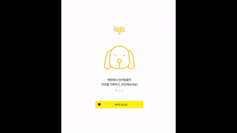

**설명**

- 반려동물 등록 페이지의 Input/Form을 Dumb 컴포넌트로 분리하고 디자인 시스템 규칙에 맞게 구성해 UI 표현 레이어를 정리
- 폼 상태와 유효성 검증 로직은 상위 도메인 훅에서 단일 관리해 비즈니스 로직과 UI 책임을 명확히 분리
- 인증 이후 isNewUser 여부에 따라 온보딩 단계를 분기하는 플로우를 모델링해 사용자 진입 흐름을 안정화

**핵심 포인트**

- UI 표현과 도메인 로직을 분리해 구조적 안정성과 재사용성을 확보

**시퀀스 다이어그램**

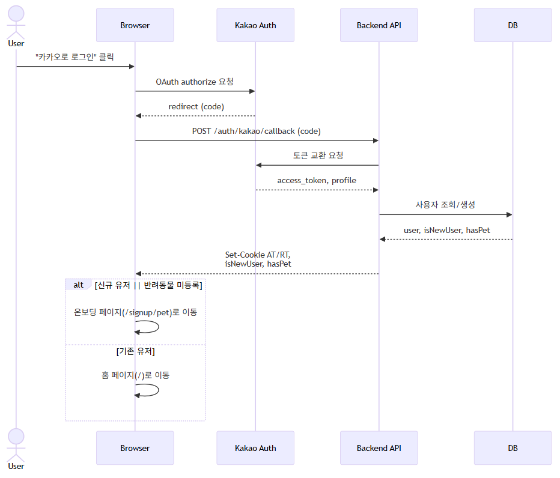

> Kakao OAuth 콜백 이후, 백엔드에서 AT/RT를 발급하고 `isNewUser`, `hasPet`에 따라 온보딩 또는 홈으로 분기되는 흐름을 표현했습니다. 

> **참고:** 
> 현재 구현에서는 `isNewUser` 하나로 `onboarding/authenticated`를 판별하고 있습니다. 향후에는 `hasPet`을 분리해 **인증 상태**와 **온보딩 상태**를 명확히 나누는 것을 리팩토링 과제로 두고 있습니다.

### 2. 홈 BriefCard 모달, 달력 페이지

  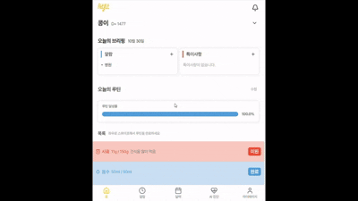
  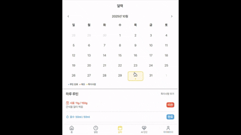

**설명**

- 특이사항 상태를 React Query 캐시 단일 진실원(SSOT)으로 통합해 홈/달력이 동일한 데이터 흐름을 사용하도록 구성

- CRUD는 invalidateQueries로 동기화하고, 날짜 변경은 쿼리 기반 조회로 처리해 UI 전체가 서버 상태와 일관되게 맞춰지도록 구성

**핵심 포인트**

- 서버 데이터를 중심으로 한 일원화된 데이터 흐름 확보
- 로컬 상태 제거로 동기화/경합 문제를 근본적으로 해소

> **기술 흐름 요약:** 
> 특이사항 생성/수정/삭제 요청을 axios로 수행하고, 
> 성공 시 invalidateQueries(['remarks', petId])를 호출해 
> 홈/달력이 React Query 캐시를 통해 자동으로 최신 상태로 갱신됩니다.

## 내가 개발팀에 기여한 일

- OAuth 로그인 구조 명확화 및 보안 강화
  - 카카오 로그인 리디렉션 문제를 해결하고, 백엔드에 **시퀀스 다이어그램을 요청해 팀 전체가 인증 흐름을 일관되게 이해하도록 지원**
  - 이후 **`memberId` XSS 방지와 HttpOnly 쿠키 기반 인증으로 전환**해 보안 체계를 강화

- 디자인 시스템 적용 및 Storybook 문서화 주도
  - 기존 컴포넌트를 점진적으로 치환하기 위한 **`비파괴적 안전망` 전략 설계**
  - Form/Input 구조 변경, 검증 책임 분리 등 **사전 충돌이 예상되는 변경을 RFC 기반으로 합의**하여 개발 기준 정립
  - Storybook 기반 **Seed 컴포넌트 구현 및 팀 내 사용 가이드 확립**

- 타입 구조 리팩토링 및 도메인 모델 명확화
  - 빈번한 백엔드 스펙 변경에 대응하기 위해 호출부를 분리하고, 타입을 **`dto / base / entity / ui` 계층으로 구조화**
  - **Date 객체/타임존 불일치 문제를 해결**해 데이터 변환 책임과 UI 모델의 경계를 명확히 분리

- 기술 의사결정 기록체계 확립 (ADR, RFC)
  - 토큰 관리, SSOT 구조 개선, 디자인 시스템 적용 등 주요 기술 결정을 **ADR로 문서화**
  - **RFC 기반 사전 리스크 검증 및 변경 공유 프로세스**를 팀 내에 정착

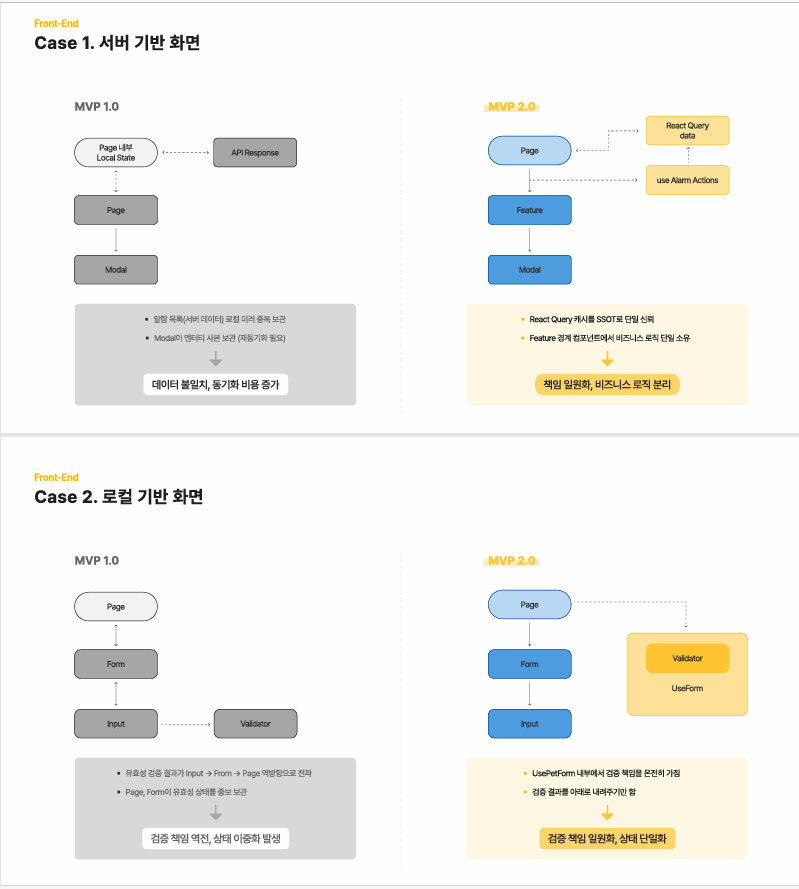

## 🧱 개발 이슈

### 1. 서버 데이터 SSOT 구조 확립

> “서버 데이터는 React Query 캐시 하나만 진실원으로, 모든 화면은 캐시만 바라보도록 구조를 재편했습니다.”

**문제 (MVP 1.0)**

- 알람, 특이사항 데이터가 **Page 로컬 상태, Modal 로컬 상태, API 응답**으로 중복 관리됨
- 컴포넌트 별로 독립 상태를 보유하면서 불일치/동기화/경합 문제가 반복 발생
- 동기화 트리거가 여러 컴포넌트에 분산되어 캐시 갱신/재조회 정책이 일관되지 않았고, 변경 시 누락·중복 처리 위험이 컸음

**개선 (MVP 2.0)**

- React Query 캐시를 **서버 데이터 단일 진실원(SSOT)** 으로 확립
- 모든 컴포넌트는 RQ 캐시 -> UI 단방향 구조만 사용
- petId 변경 시 자동 refetch 구조로 일관성, 예측 가능성 확보
- Mutation 이후 갱신을 invalidateQueries로 표준화해, 모든 화면이 같은 재조회 규약을 따르도록 정리
- 쓰기 작업의 후속 동기화를 단일 경로(invalidate) 로 고정하여 로컬 미러/수동 동기화 제거

**결과**

- 중복 상태 제거로 코드 복잡도 감소
- “서버 데이터는 오직 한 곳에서 관리한다”는 구조적 안정성 확보
- 데이터 레이스 및 stale 문제 근본 해결

---

### 2. 폼 검증 책임 단일화 & DS 적용 기반 확보

> “유효성 검증, 상태 관리를 도메인 훅으로 단일화하고, Input/Form은 표현만 담당하도록 완전히 분리했습니다.”

**문제 (MVP 1.0)**

- Page/Form/Input이 각자 유효성 로직을 보유해 검증 책임이 파편화
- 상·하위 컴포넌트 간 유효성 값을 계속 전달해야 하는 구조
- 검증/상태/UI가 결합되어 디자인 시스템 컴포넌트로 추출 불가능한 구조

**개선 (MVP 2.0)**

- usePetForm에서 검증 결과(errors/isValid), touched, 필드 업데이트(setField) 를 단일화해 UI는 표현만 담당
- Input/Form을 Dumb Component로 정리해 UI 표현만 담당
- 도메인 훅 → Dumb 컴포넌트 방향의 단방향 데이터 흐름 확립
- Seed 컴포넌트(Field, InputBase)를 설계하고 Storybook 기반으로 **DS 기반 재사용 가능한 폼 컴포넌트**로 확장

**결과**

- 폼 구조가 UI/로직이 분리된 아키텍처로 정리
- 컴포넌트 재사용성이 비약적으로 증가
- DS 도입에 필요한 “표현 레이어의 순수화” 달성

### 3. 인증/세션 구조 개선 (JWT + HttpOnly 쿠키 + FSM)

> “토큰 저장 방식을 HttpOnly 쿠키 기반으로 전환하고, 인증 로직이 페이지마다 파편화되어 있던 문제를 제거하여, 보안성을 강화하고 세션 상태를 예측 가능한 구조로 재정비 했습니다.”

**문제 (MVP 1.0)**

- Access/Refresh Token을 LocalStorage에 보관해 XSS 취약성 및 세션 관리 불확실성 존재
- 초기 세션 체크(/auth/me, /refresh)가 라우터 가드 곳곳에서 실행되어 흐름이 일관되지 않음
- 토큰 만료·재발급 실패 등의 예외가 각기 다른 위치에서 처리되어 전역 인증 흐름이 불안정함
- 신규 사용자 여부(isNewUser) 판별도 클라이언트 기준으로 수행해 온보딩 플로우 불명확

**개선 (MVP 2.0)**

- 토큰을 HttpOnly 쿠키 기반으로 전환해 보안성을 확보
- 인증 플로우를 FSM(State Machine) 으로 모델링해 상태 전이가 명확해짐
  - Unauthenticated → Checking → Onboarding → Authenticated
  - Return Node 기반의 만료/실패 공통 처리
- 초기 인증 로직을 중앙화하여 라우터 가드 파편화 문제 제거
- isNewUser→hasPet 분리 로드맵 확립으로 온보딩 상태 판단 기준 정교화

**결과**

- 인증 로직이 “한 곳에서 움직이고 한 곳에서 실패하는 구조”로 단순화
- 토큰 수명주기와 인증 예외 처리가 예측 가능한 상태 모델로 정리
- 전체 사용자 진입 흐름의 신뢰도·일관성 개선

## 회고

디자인 시스템 컴포넌트를 만들며, 재활용 가능한 컴포넌트 기준이 좀 더 디테일하게(Atomic-Dumb, Presentation) 구분되었고, 자연스레 컴포넌트의 책임 분리를 할 수 있었다.
협업 과정에서 RFC와 ADR를 활용하여 의사결정에 있어 팀원과 더 효율적으로 진행할 수 있는 방법을 찾을 수 있었다.
마지막으로, 실제 서비스를 동아리원, 테스트원 40명 가량 실제 리뷰를 받아보니 생각보다 동일한 서비스를 다양한 시각으로 바라보고 다양한 해석이 나올 수 있다는걸 깨달았습니다.
